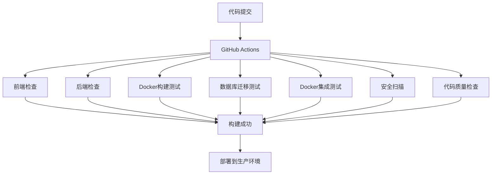

# CI/CD 实施文档

## 概述

本文档详细说明了 Smart Wallet Dashboard 项目的 CI/CD（持续集成/持续部署）实施，包括 GitHub Actions 工作流、Docker 容器化、自动化测试和部署流程。

## 架构图



## 工作流配置

### 1. 触发条件

- **Push 事件**: 推送到 `main` 或 `develop` 分支
- **Pull Request**: 创建或更新 PR 到 `main` 或 `develop` 分支

### 2. 工作流步骤

#### 2.1 前端检查 (frontend-check)

- **Node.js 版本**: 18
- **缓存策略**: npm 缓存
- **检查项目**:
  - 依赖安装 (`npm ci`)
  - ESLint 代码风格检查
  - TypeScript 类型检查
  - 生产构建测试
- **产物**: 构建文件上传到 GitHub Actions Artifacts

#### 2.2 后端检查 (backend-check)

- **Node.js 版本**: 18
- **缓存策略**: npm 缓存（backend 目录）
- **检查项目**:
  - 依赖安装 (`npm ci`)
  - ESLint 代码风格检查
  - TypeScript 类型检查
  - 生产构建测试
- **产物**: 构建文件上传到 GitHub Actions Artifacts

#### 2.3 Docker 构建测试 (docker-build)

- **依赖**: 前端和后端检查通过
- **测试项目**:
  - 前端 Docker 镜像构建
  - 后端 Docker 镜像构建
  - 构建缓存优化
- **缓存策略**: GitHub Actions 缓存

#### 2.4 数据库迁移测试 (database-test)

- **服务依赖**:
  - PostgreSQL 15 (测试数据库)
  - Redis 7 (测试缓存)
- **测试项目**:
  - Prisma 客户端生成
  - 数据库迁移执行
  - 数据库连接测试
- **环境变量**: 测试专用数据库配置

#### 2.5 Docker 集成测试 (docker-integration-test)

- **依赖**: Docker 构建和数据库测试通过
- **测试项目**:
  - 完整服务栈启动
  - 服务健康检查
  - API 端点测试
  - 服务间通信验证
- **环境**: 使用测试专用 Docker Compose 配置

#### 2.6 安全扫描 (security-scan)

- **工具**: Trivy 漏洞扫描器
- **扫描范围**: 文件系统扫描
- **输出格式**: SARIF
- **集成**: GitHub Security Tab

#### 2.7 代码质量检查 (code-quality)

- **工具**: SonarCloud
- **检查项目**:
  - 代码质量指标
  - 代码覆盖率
  - 技术债务分析
  - 安全漏洞检测

## Docker 配置

### 1. 生产环境 (docker-compose.yml)

- **服务**: web, bff, postgres, redis
- **网络**: smart-wallet-network
- **数据持久化**: 命名卷
- **健康检查**: 所有服务

### 2. 测试环境 (docker-compose.test.yml)

- **服务**: web-test, bff-test, postgres-test, redis-test
- **网络**: smart-wallet-test-network
- **端口映射**: 避免冲突
- **数据持久化**: 测试专用卷

## 环境变量管理

### 1. GitHub Secrets

- `ETHERSCAN_API_KEY`: Etherscan API 密钥
- `SONAR_TOKEN`: SonarCloud 分析令牌
- `DATABASE_URL`: 生产数据库连接字符串
- `REDIS_URL`: 生产 Redis 连接字符串
- `CORS_ORIGIN`: 允许的跨域来源

### 2. 环境配置

- **开发环境**: `.env.local`
- **测试环境**: CI/CD 自动生成
- **生产环境**: GitHub Secrets

## 本地测试

### 1. 运行 CI/CD 测试脚本

```bash
# 执行完整的CI/CD测试流程
./scripts/test-ci.sh
```

### 2. 单独测试步骤

```bash
# 前端检查
npm ci && npm run lint && npm run type-check && npm run build

# 后端检查
cd backend && npm ci && npm run lint && npm run type-check && npm run build

# Docker构建测试
docker build -t smart-wallet-dashboard-frontend:test .
docker build -t smart-wallet-dashboard-backend:test ./backend

# 数据库测试
docker-compose -f docker-compose.test.yml up postgres-test redis-test -d
cd backend && npx prisma migrate deploy

# 集成测试
docker-compose -f docker-compose.test.yml up -d --build
```

## 监控和告警

### 1. GitHub Actions 状态

- 工作流运行状态
- 失败通知
- 构建时间监控

### 2. 安全监控

- 漏洞扫描结果
- 依赖安全更新
- 代码质量趋势

### 3. 性能监控

- 构建时间优化
- 缓存命中率
- 资源使用情况

## 故障排除

### 1. 常见问题

#### 构建失败

- **原因**: 依赖问题、代码错误
- **解决**: 检查日志、修复代码、更新依赖

#### 测试失败

- **原因**: 环境配置、服务启动问题
- **解决**: 检查环境变量、服务配置

#### Docker 构建失败

- **原因**: Dockerfile 错误、资源不足
- **解决**: 检查 Dockerfile、增加资源

### 2. 调试步骤

1. 查看 GitHub Actions 日志
2. 本地复现问题
3. 检查环境配置
4. 验证依赖版本
5. 测试服务连通性

## 最佳实践

### 1. 代码质量

- 提交前运行本地测试
- 保持代码风格一致
- 及时修复安全漏洞

### 2. 性能优化

- 使用构建缓存
- 优化 Docker 镜像大小
- 并行执行测试

### 3. 安全实践

- 定期更新依赖
- 使用最小权限原则
- 保护敏感信息

## 扩展计划

### 1. 持续部署

- 自动部署到测试环境
- 生产环境部署审批
- 蓝绿部署策略

### 2. 监控集成

- Prometheus 指标收集
- Grafana 仪表板
- 告警通知

### 3. 多环境支持

- 开发环境
- 测试环境
- 预生产环境
- 生产环境

## 总结

本 CI/CD 实施提供了完整的自动化流程，包括代码检查、构建测试、集成测试、安全扫描和质量检查。通过 Docker 容器化和 GitHub Actions，确保了开发环境的一致性和部署的可靠性。

关键特性：

- ✅ 自动化测试流程
- ✅ Docker 容器化部署
- ✅ 安全漏洞扫描
- ✅ 代码质量检查
- ✅ 多环境支持
- ✅ 本地测试支持
