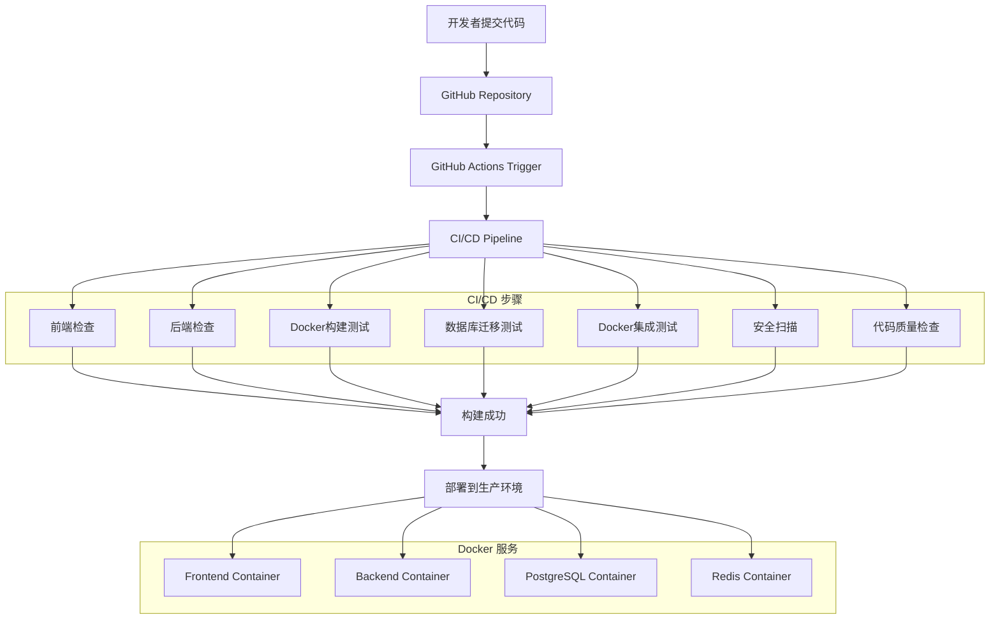
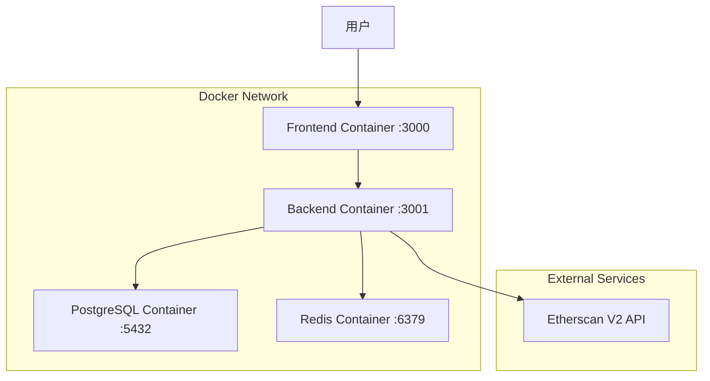
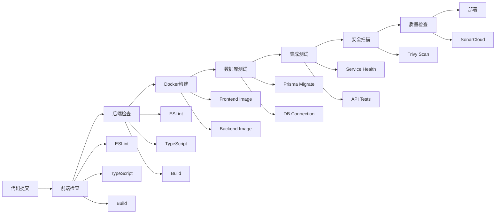
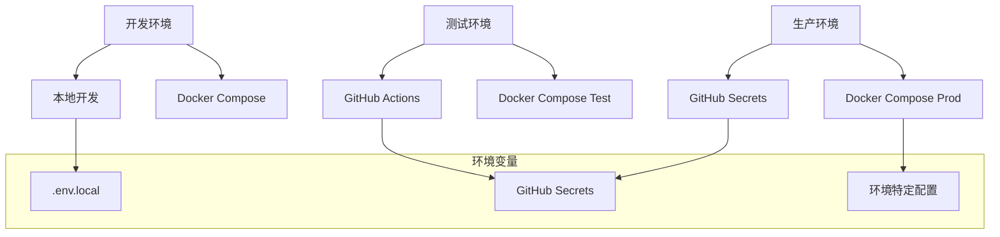
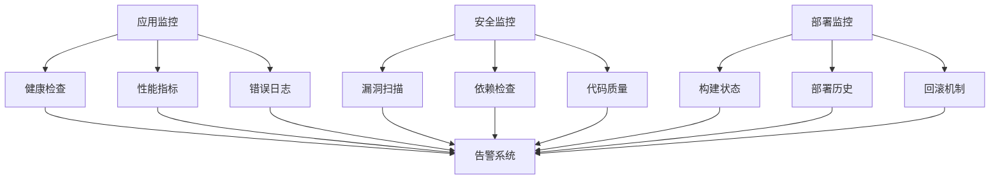

# CI/CD 架构图

## 整体架构

```mermaid
graph TB
    A[开发者提交代码] --> B[GitHub Repository]
    B --> C[GitHub Actions Trigger]
    C --> D[CI/CD Pipeline]

    D --> E[前端检查]
    D --> F[后端检查]
    D --> G[Docker构建测试]
    D --> H[数据库迁移测试]
    D --> I[Docker集成测试]
    D --> J[安全扫描]
    D --> K[代码质量检查]

    E --> L[构建成功]
    F --> L
    G --> L
    H --> L
    I --> L
    J --> L
    K --> L

    L --> M[部署到生产环境]

    subgraph "CI/CD 步骤"
        E
        F
        G
        H
        I
        J
        K
    end

    subgraph "Docker 服务"
        N[Frontend Container]
        O[Backend Container]
        P[PostgreSQL Container]
        Q[Redis Container]
    end

    M --> N
    M --> O
    M --> P
    M --> Q
```

## 服务架构

```mermaid
graph TB
    A[用户] --> B[Frontend Container :3000]
    B --> C[Backend Container :3001]
    C --> D[PostgreSQL Container :5432]
    C --> E[Redis Container :6379]
    C --> F[Etherscan V2 API]

    subgraph "Docker Network"
        B
        C
        D
        E
    end

    subgraph "External Services"
        F
    end
```

## 测试流程

```mermaid
graph LR
    A[代码提交] --> B[前端检查]
    B --> C[后端检查]
    C --> D[Docker构建]
    D --> E[数据库测试]
    E --> F[集成测试]
    F --> G[安全扫描]
    G --> H[质量检查]
    H --> I[部署]

    B --> J[ESLint]
    B --> K[TypeScript]
    B --> L[Build]

    C --> M[ESLint]
    C --> N[TypeScript]
    C --> O[Build]

    D --> P[Frontend Image]
    D --> Q[Backend Image]

    E --> R[Prisma Migrate]
    E --> S[DB Connection]

    F --> T[Service Health]
    F --> U[API Tests]

    G --> V[Trivy Scan]

    H --> W[SonarCloud]
```

## 环境配置

```mermaid
graph TB
    A[开发环境] --> B[本地开发]
    A --> C[Docker Compose]

    D[测试环境] --> E[GitHub Actions]
    D --> F[Docker Compose Test]

    G[生产环境] --> H[GitHub Secrets]
    G --> I[Docker Compose Prod]

    subgraph "环境变量"
        J[.env.local]
        K[GitHub Secrets]
        L[环境特定配置]
    end

    B --> J
    E --> K
    H --> K
    I --> L
```

## 监控和告警

```mermaid
graph TB
    A[应用监控] --> B[健康检查]
    A --> C[性能指标]
    A --> D[错误日志]

    E[安全监控] --> F[漏洞扫描]
    E --> G[依赖检查]
    E --> H[代码质量]

    I[部署监控] --> J[构建状态]
    I --> K[部署历史]
    I --> L[回滚机制]

    B --> M[告警系统]
    C --> M
    D --> M
    F --> M
    G --> M
    H --> M
    J --> M
    K --> M
    L --> M
```
